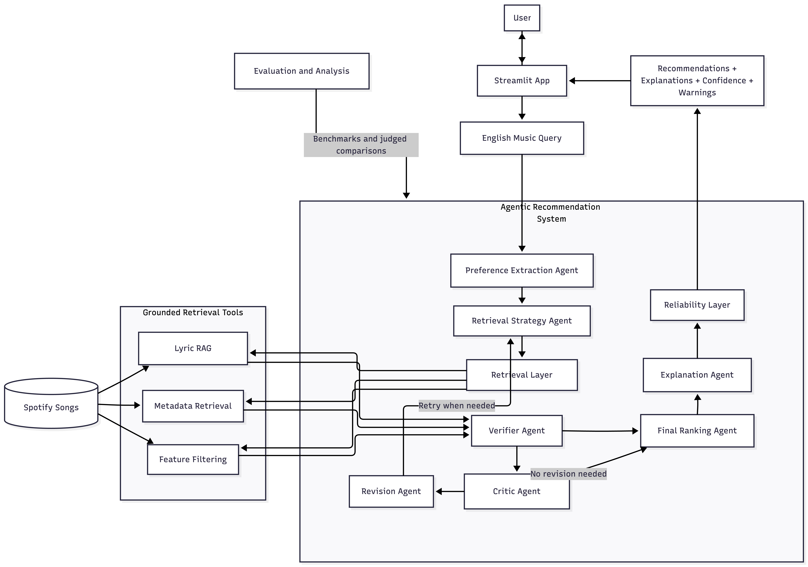
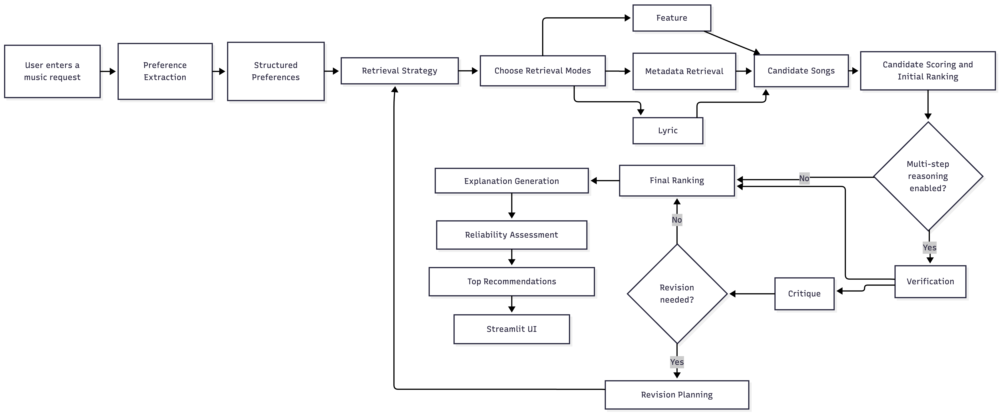
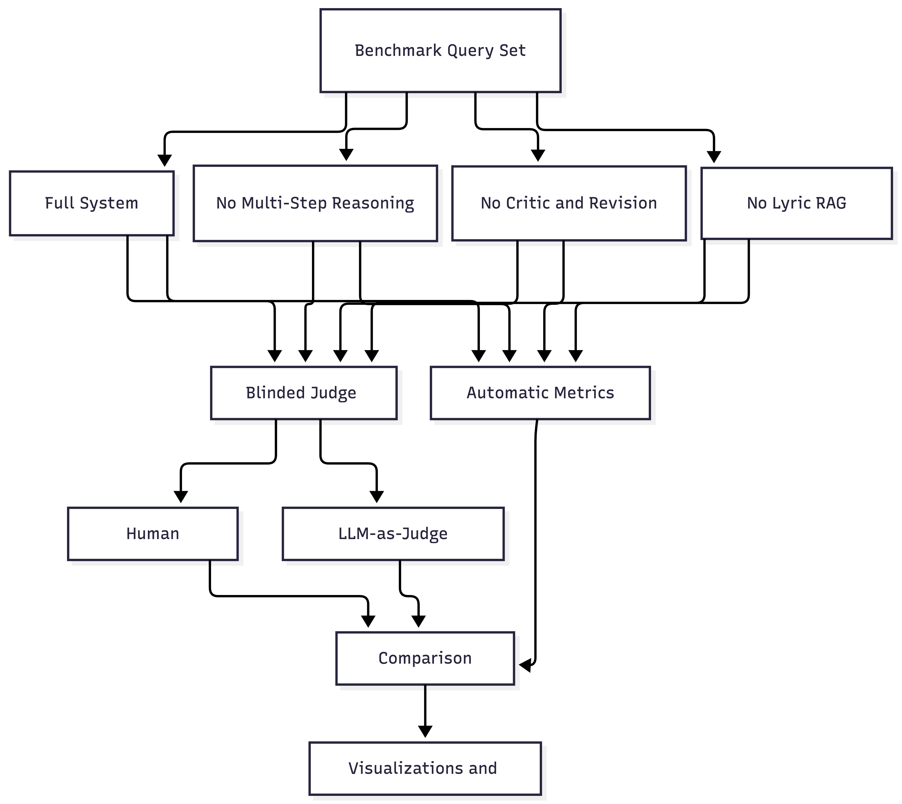

# VibeFinder AI

VibeFinder AI is an agentic music recommendation system built on top of the Kaggle [**Audio features and lyrics of Spotify songs**](https://www.kaggle.com/datasets/imuhammad/audio-features-and-lyrics-of-spotify-songs) dataset. A user describes the kind of music they want in plain English, and the system converts that request into structured preferences, retrieves candidate tracks with grounded tools, critiques weak results, ranks the final songs, explains each recommendation, and reports confidence and warnings.

## Base Project

This project extends my Module 3 project, **Music Recommender Simulation**. The original system was a small, transparent content-based recommender: it compared a user's stated genre, mood, energy, and acoustic preference against a tiny song catalog and ranked songs with a deterministic scoring rule. It was useful for understanding recommendation logic and bias, but it did not understand natural-language requests, did not use lyrics, and did not include retrieval, agentic planning, critique, or reliability evaluation.

## Why This Project Matters

The base project showed how a simple recommender can score songs from structured features. VibeFinder AI extends that idea into a full applied AI system with:

- natural-language preference extraction
- Lyric RAG over song lyrics
- multi-step agentic workflow with verification, critique, and revision
- deterministic ranking and reliability checks
- reproducible evaluation and judged comparison between ablations

## System Overview

The end-to-end workflow is:

1. The user enters a query in English.
2. A preference extraction agent converts the query into structured preferences.
3. A retrieval planning agent decides which grounded tools to use.
4. Retrieval tools search the dataset with metadata filters, audio-feature filters, and Lyric RAG.
5. Candidates are scored deterministically.
6. A verifier checks whether the candidates actually satisfy the request.
7. A critic identifies weak coverage or ranking problems.
8. A revision step can retry the plan with bounded iteration.
9. An explanation agent writes grounded reasons for the final ranked tracks.
10. A reliability layer assigns confidence and warnings.

This keeps the reasoning flexible while keeping retrieval, ranking, and guardrails explicit and testable.

## Architecture Overview

The high-level diagrams are in [assets/architecture.png](assets/architecture.png), [assets/flowchart.png](assets/flowchart.png), and [assets/evaluation.png](assets/evaluation.png).



- `architecture.png` shows the main components: Streamlit UI, LangGraph workflow, LLM connector, retrieval tools, FAISS lyric index, dataset, and evaluation.



- `flowchart.png` shows the runtime flow from user query to final recommendations, explanations, confidence, and warnings.



- `evaluation.png` shows how saved run outputs are compared through automatic metrics and blinded human or LLM judging.

The current implementation matches that structure:

- **Frontend:** Streamlit app in `app.py`
- **Workflow orchestration:** LangGraph in `src/vibefinder/graph.py`
- **LLM layer:** provider-agnostic connector in `src/vibefinder/llm.py`
- **Metadata and feature retrieval:** pandas-based tools under `src/vibefinder/tools/`
- **Lyric RAG:** FAISS index over lyric embeddings
- **Reliability and evaluation:** deterministic checks plus evaluation scripts in `scripts/`

## Setup

Python 3.11 is required.

### 1. Create a virtual environment

```bash
python3.11 -m venv .venv
source .venv/bin/activate
```

### 2. Install the package

```bash
.venv/bin/python -m pip install -e .
```

### 3. Configure environment variables

Copy the example file:

```bash
cp .env.example .env
```

Important settings:

- `VIBEFINDER_LLM_PROVIDER=gemini`
- `VIBEFINDER_LLM_MODEL=gemini-2.5-flash`
- `GEMINI_API_KEY=...`
- `VIBEFINDER_DATA_PATH=.`

`app.py` auto-loads `.env` from the project root without overwriting variables already exported in the shell.

If `VIBEFINDER_LLM_MODEL` is left unset, the code-level fallback in `src/vibefinder/llm.py` is also `gemini-2.5-flash`.

### 4. Download the dataset and build the lyric index

```bash
.venv/bin/python scripts/setup_dataset_index.py
```

This setup script:

- downloads `spotify_songs.csv` to the project root if it is missing
- validates the dataset
- builds `lyric_faiss.index` and `lyric_faiss_metadata.json` if they are missing
- logs setup progress to `logs/setup_dataset_index.log`

Useful options:

```bash
.venv/bin/python scripts/setup_dataset_index.py --embedding-device mps
.venv/bin/python scripts/setup_dataset_index.py --embedding-batch-size 16
.venv/bin/python scripts/setup_dataset_index.py --data-path ./spotify_songs.csv
```

## Running the System

### Main demo app

```bash
.venv/bin/streamlit run app.py
```

The app:

- loads the dataset from the project root
- loads or builds the lyric FAISS index
- runs the LangGraph recommendation pipeline
- renders ranked recommendations, explanations, Spotify iframes, confidence, and warnings

### Human evaluation app

```bash
.venv/bin/streamlit run human_eval_app.py
```

This app supports blinded side-by-side judging of `System A` versus `System B` outputs and writes draft or final labels to `evaluation/judgements/human/`.

## Testing

Run the test suite with:

```bash
.venv/bin/pytest
```

The tests cover:

- dataset loading
- retrieval prompt config loading
- metadata retrieval
- feature filtering
- Lyric RAG retrieval
- candidate scoring
- reliability output
- LLM connector behavior
- agent schemas
- LangGraph runtime and node behavior
- evaluation and judged-report helpers

## Sample Interactions

These examples come from saved full-system evaluation runs with Gemini.

### Example 1

**Input**

`English songs that sound happy but actually have sad or dark lyrics, with good storytelling`

**Output summary**

- Confidence: `medium` (`0.53`)
- Top results included:
  - `Only Happy When It Rains - Garbage`
  - `Rolling in the Deep - Adele`
  - `Listen to the Music - The Doobie Brothers`
- The system used Lyric RAG and produced grounded explanations for every ranked item.

### Example 2

**Input**

`Songs about being cheated on, but from the perspective of the person who did the cheating, in English`

**Output summary**

- Confidence: `low` (`0.39`)
- Top results included:
  - `The Chain - Fleetwood Mac`
  - `Alarm - Anne-Marie`
  - `I Never Loved a Man (The Way I Love You) - Aretha Franklin`
- The system warned that several tracks matched betrayal themes but **did not match the requested cheater perspective**. This is an example of the guardrail behavior surfacing weak matches instead of silently overclaiming.

### Example 3

**Input**

`Songs about betrayal with strong lyrical storytelling, high energy, and preferably from female artists`

**Output summary**

- Confidence: `medium` (`0.60`)
- Top results included:
  - `Now That We're Dead - Metallica`
  - `The Story Never Ends - Lauv`
  - `The Voices - dreamEater`
- The system mixed lyric retrieval and feature filtering, then ranked the final list and generated explanations for each recommendation.

## Design Decisions

### LangGraph for workflow control

I used LangGraph because the project has a real staged pipeline: extraction, planning, retrieval, verification, critique, revision, explanation, and reliability. LangGraph makes the control flow explicit without hiding the project logic inside a black-box agent wrapper.

### Deterministic tools for grounding

Retrieval, filtering, scoring, and reliability are implemented as deterministic tools. This keeps the evidence path inspectable and makes evaluation fairer across model backends.

### Lyric RAG with FAISS

The strongest extension beyond the base project is Lyric RAG. Instead of relying only on genre or audio features, the system semantically retrieves lyric-heavy candidates from the real dataset and then grounds later reasoning on those retrieved tracks.

### Provider-agnostic LLM layer

The workflow uses LLM-based agents, but the repo is not hardcoded to one provider. The same graph can run with Gemini, OpenAI-compatible backends, Ollama, and local or self-hosted endpoints through `src/vibefinder/llm.py`.

### Reliability over overclaiming

The system does not assume every query can be answered well. It explicitly outputs confidence and warnings when:

- the result set is weak
- hard constraints are only partially satisfied
- lyric perspective or theme is underspecified
- the explanation step had to fall back

## Evaluation and Reliability

### Automatic evaluation

Run the benchmark evaluation with:

```bash
.venv/bin/python scripts/run_evaluation.py
```

Useful options:

```bash
.venv/bin/python scripts/run_evaluation.py --max-queries 1 --variants full
.venv/bin/python scripts/run_evaluation.py --variants full,no_lyric_retriever --top-k 5
.venv/bin/python scripts/run_evaluation.py --query-cooldown-seconds 10
.venv/bin/python scripts/run_evaluation.py --force
.venv/bin/python scripts/run_evaluation.py --allow-partial-report
```

The current benchmark uses `evaluation/benchmark_queries.json` with 10 queries across:

- `lyric_theme`
- `mixed`
- `hard_constraints`

Default variants:

- `full`
- `no_critic_revision`
- `no_lyric_retriever`

The runner writes:

- per-run resumable files under `evaluation/results/runs/`
- aggregate reports under `evaluation/results/`
- `latest.json`, `latest.md`, and `latest_status.json`

### Current automatic results

From `evaluation/results/latest.md`:

- `full`: average confidence `0.496`, expected retrieval mode recall `0.967`, lyric evidence `1.000`
- `no_critic_revision`: average confidence `0.498`, expected retrieval mode recall `0.917`, lyric evidence `1.000`
- `no_lyric_retriever`: average confidence `0.389`, expected retrieval mode recall `0.433`, lyric evidence `0.000`

The strongest measurable drop is when Lyric RAG is removed.

### Blinded judged evaluation

Build judge tasks:

```bash
.venv/bin/python scripts/build_judge_tasks.py
```

Run LLM-as-judge:

```bash
.venv/bin/python scripts/run_llm_judge.py
```

Aggregate the report and visualizations:

```bash
.venv/bin/python scripts/aggregate_judgements.py \
  --labels evaluation/judgements/llm/JUDGE_ID/labels.jsonl \
  --judge-mode llm \
  --judge-id JUDGE_ID \
  --output-dir evaluation/judgements/llm/reports
```

The aggregation script writes one combined Markdown report, one JSON report, and the visualization artifacts into the output directory.

### Current judged results

From `evaluation/judgements/llm/reports/latest_judge_report.md`:

- **Lyric RAG:** full system won `90%` of tasks against `no_lyric_retriever`
- **Critic / Revision:** full system won `50%`, ablation won `40%`, and `10%` were ties

This supports the project claim that Lyric RAG is a major quality driver, while critic/revision helps more selectively.

## Logging and Traceability

- App logs: `logs/app.log`
- Setup logs: `logs/setup_dataset_index.log`
- Evaluation logs: `logs/evaluation.log`

The code logs:

- incoming query
- extracted preferences
- retrieval strategy
- retrieval mode usage
- candidate counts
- verifier findings
- critique and revision events
- final confidence and warnings

LangSmith tracing is optional. When enabled, it traces graph runs, agent nodes, tool calls, retries, and final outputs.

Note that the current `.env.example` includes LangSmith tracing flags set to `true`. If you do not want remote tracing, set `LANGSMITH_TRACING=false` and `LANGSMITH_TRACING_V2=false` in your local `.env`.

## Limitations

- The system is limited to the Spotify Kaggle dataset in this repository.
- Recommendation quality depends on the selected LLM and its ability to produce valid JSON.
- Queries that require subtle lyrical perspective or world knowledge remain difficult.
- The system can retrieve semantically related lyrics, but it does not truly understand lyrics the way a human music expert would.
- The UI is a course-demo interface, not a production recommendation product.

## Reflection

This project changed the original music recommender from a small transparent scoring simulation into a full AI workflow with retrieval, reasoning, critique, and evaluation. The main lesson was that LLM-based orchestration is only useful when the data path stays grounded and inspectable. That pushed the design toward deterministic tools, explicit schemas, and bounded graph stages instead of a single opaque agent call.

The hardest part of testing was making sure different LLMs returned valid JSON consistently enough for the workflow to stay stable. The agentic pipeline became fragile whenever structured outputs drifted, and fixing that required repeated prompt engineering and much more context in the system prompts than I expected. A helpful AI suggestion during development was to include the required output schema directly in the prompt, which improved structured extraction reliability across models. A flawed AI suggestion was an overcomplicated month-long project plan with unnecessary features like login and user management; I rejected that and kept the project focused on retrieval, ranking, and reliability.

## Ethics and Misuse

This system can be misleading if its outputs are treated as authoritative interpretations of lyrical meaning. The main mitigation is to keep the dataset boundary explicit, ground explanations in retrieved evidence, and surface warnings when confidence is low or the match is partial. It could also reinforce dataset bias, because underrepresented genres, languages, or lyrical themes in the source data will be harder to retrieve well.

## Demo / Walkthrough

Loom link: https://www.loom.com/share/796076cf00834195b62403e6b505cdeb
