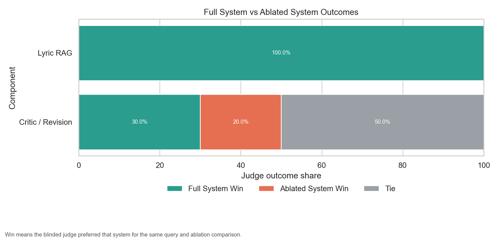
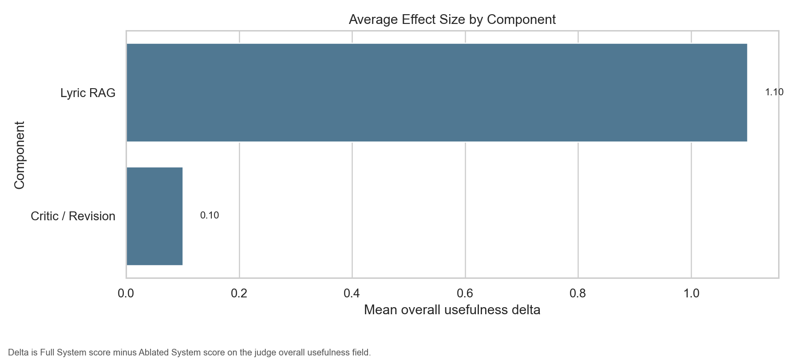
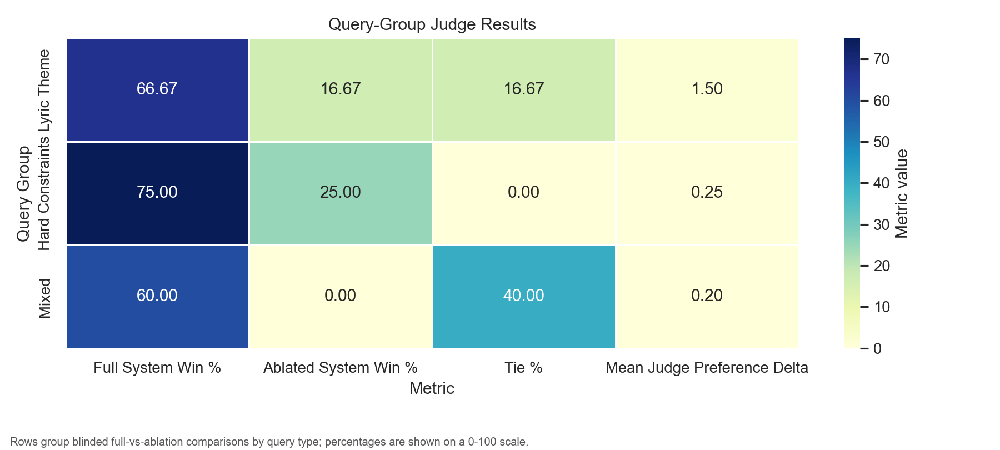
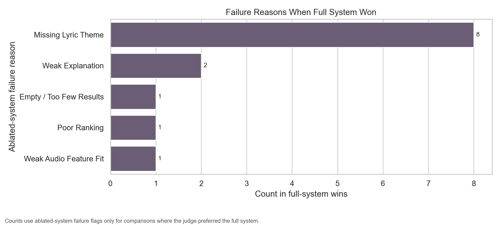

# VibeFinder Judged Evaluation

- Generated at: 2026-04-25T00:45:44.834368+00:00
- Judge mode: human
- Judge id: esmaeil
- Judgements: 20

## Component Results

| Component | Tasks | Full Win | Ablation Win | Tie | Avg Overall Delta | Avg Score Delta | Top Ablation Failures |
| --- | ---: | ---: | ---: | ---: | ---: | ---: | --- |
| critic_revision | 10 | 30.0% | 20.0% | 50.0% | 0.100 | 0.171 | poor_ranking, weak_explanation |
| lyric_retrieval | 10 | 100.0% | 0.0% | 0.0% | 1.100 | 1.386 | missing_lyric_theme, empty_or_too_few_results, weak_audio_feature_fit |

## Query Group Results

| Group | Tasks | Full Win | Ablation Win | Tie | Avg Overall Delta |
| --- | ---: | ---: | ---: | ---: | ---: |
| hard_constraints | 4 | 75.0% | 25.0% | 0.0% | 0.250 |
| lyric_theme | 6 | 66.7% | 16.7% | 16.7% | 1.500 |
| mixed | 10 | 60.0% | 0.0% | 40.0% | 0.200 |

---

# Judge Visualization Report

- Generated from: `/Users/esmaeil/MyData/MyProjects/VibeFinderAI/evaluation/judgements/human/esmaeil/labels.jsonl`
- Judge mode: human
- Judge id: esmaeil
- Matched judgements: 20

## Component-Level Results

Blinded judge outcome share for full-system recommendations versus ablated recommendations.

| Component | Tasks | Full System Win | Ablated System Win | Tie | Mean Judge Preference Delta | Mean Score Margin | Most Common Failure Modes |
| --- | --- | --- | --- | --- | --- | --- | --- |
| Lyric RAG | 10 | 100.0% (10/10) | 0.0% (0/10) | 0.0% (0/10) | 1.1 | 1.3857 | Missing Lyric Theme, Empty / Too Few Results, Weak Audio Feature Fit, Weak Explanation |
| Critic / Revision | 10 | 30.0% (3/10) | 20.0% (2/10) | 50.0% (5/10) | 0.1 | 0.1714 | Poor Ranking, Weak Explanation |

## Query-Group Results

| Query Group | Tasks | Full System Win | Ablated System Win | Tie | Mean Judge Preference Delta | Mean Score Margin |
| --- | --- | --- | --- | --- | --- | --- |
| Lyric Theme | 6 | 66.7% (4/6) | 16.7% (1/6) | 16.7% (1/6) | 1.5 | 1.5476 |
| Hard Constraints | 4 | 75.0% (3/4) | 25.0% (1/4) | 0.0% (0/4) | 0.25 | 0.4286 |
| Mixed | 10 | 60.0% (6/10) | 0.0% (0/10) | 40.0% (4/10) | 0.2 | 0.4571 |

## Failure Analysis

| Component | Failure Reason | Count |
| --- | --- | --- |
| Lyric RAG | Missing Lyric Theme | 8 |
| Lyric RAG | Weak Explanation | 1 |
| Critic / Revision | Weak Explanation | 1 |
| Lyric RAG | Empty / Too Few Results | 1 |
| Critic / Revision | Poor Ranking | 1 |
| Lyric RAG | Weak Audio Feature Fit | 1 |

## Representative Examples

| Component | Prompt | Winner | Judge Evidence |
| --- | --- | --- | --- |
| Lyric RAG | Songs where the lyrics clearly express revenge or payback after betrayal, not just general anger | Full System | Ablated System didn't produce any result. |
| Lyric RAG | Songs about regret after hurting someone you love, with emotional lyrics and medium to high energy | Full System | Full System is better, hands down. |
| Lyric RAG | Songs about being cheated on, but from the perspective of the person who did the cheating, in English | Full System | Full System provided songs more aligned with the requested lyric theme. |
| Critic / Revision | Songs where the lyrics clearly express revenge or payback after betrayal, not just general anger | Full System | Full System is better |
| Critic / Revision | Songs about betrayal with strong lyrical storytelling, high energy, and preferably from female artists | Full System | Full System provides better ranking with better lyric match at the top. |
| Critic / Revision | Songs about heartbreak, but avoid overly slow ballads and avoid songs with weak or generic lyrics | Full System | Full System has a little better ranking. |
