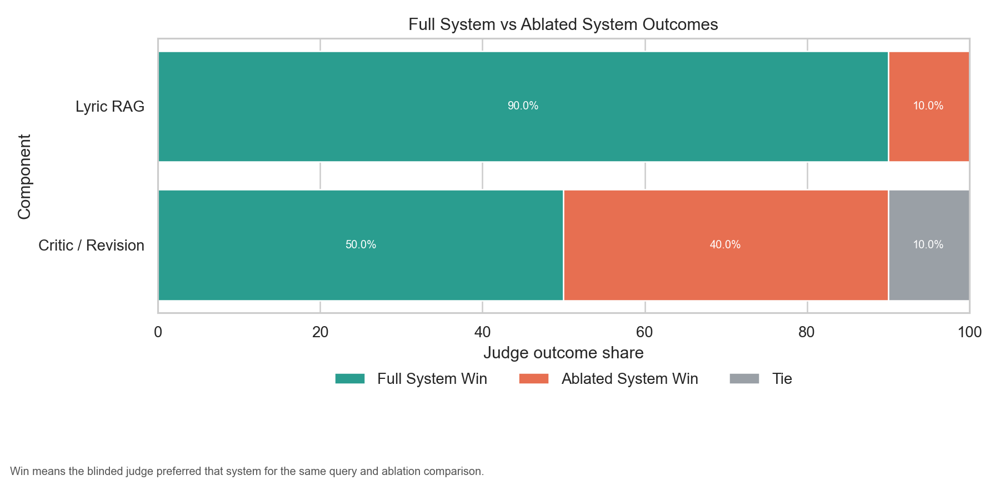
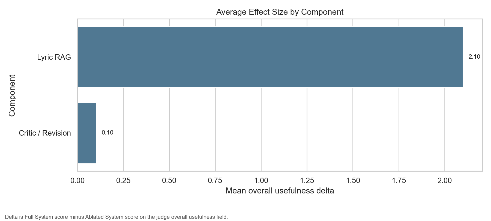
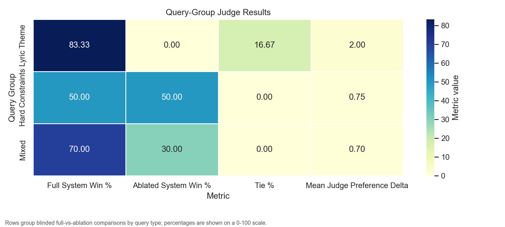
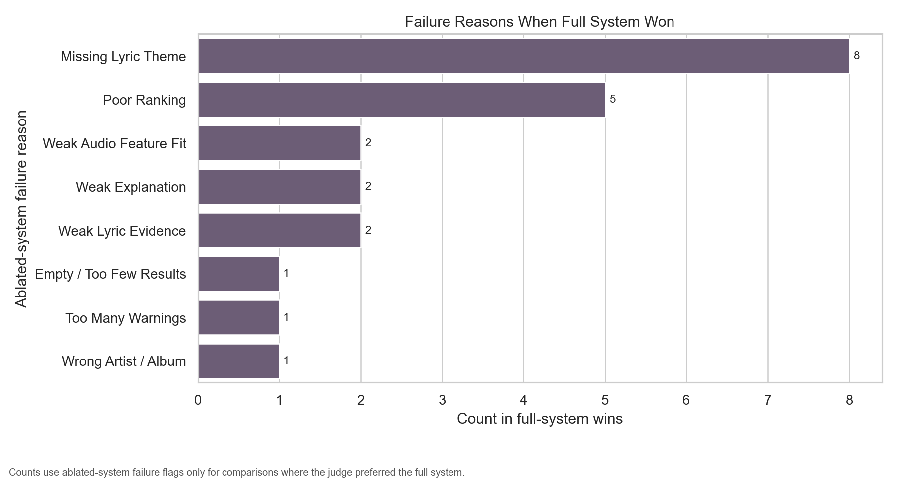

# VibeFinder Judged Evaluation

- Generated at: 2026-04-24T23:53:47.805737+00:00
- Judge mode: llm
- Judge id: gemini_gemini_3_1_flash_lite_preview
- Judgements: 20

## Component Results

| Component | Tasks | Full Win | Ablation Win | Tie | Avg Overall Delta | Avg Score Delta | Top Ablation Failures |
| --- | ---: | ---: | ---: | ---: | ---: | ---: | --- |
| critic_revision | 10 | 50.0% | 40.0% | 10.0% | 0.100 | -0.000 | weak_audio_feature_fit, missing_lyric_theme, poor_ranking |
| lyric_retrieval | 10 | 90.0% | 10.0% | 0.0% | 2.100 | 1.829 | missing_lyric_theme, poor_ranking, weak_lyric_evidence |

## Query Group Results

| Group | Tasks | Full Win | Ablation Win | Tie | Avg Overall Delta |
| --- | ---: | ---: | ---: | ---: | ---: |
| hard_constraints | 4 | 50.0% | 50.0% | 0.0% | 0.750 |
| lyric_theme | 6 | 83.3% | 0.0% | 16.7% | 2.000 |
| mixed | 10 | 70.0% | 30.0% | 0.0% | 0.700 |

---

# Judge Visualization Report

- Generated from: `/Users/esmaeil/MyData/MyProjects/VibeFinderAI/evaluation/judgements/llm/gemini_gemini_3_1_flash_lite_preview/labels.jsonl`
- Judge mode: llm
- Judge id: gemini_gemini_3_1_flash_lite_preview
- Matched judgements: 20

## Component-Level Results

Blinded judge outcome share for full-system recommendations versus ablated recommendations.

| Component | Tasks | Full System Win | Ablated System Win | Tie | Mean Judge Preference Delta | Mean Score Margin | Most Common Failure Modes |
| --- | --- | --- | --- | --- | --- | --- | --- |
| Lyric RAG | 10 | 90.0% (9/10) | 10.0% (1/10) | 0.0% (0/10) | 2.1 | 1.8285 | Missing Lyric Theme, Poor Ranking, Weak Lyric Evidence, Empty / Too Few Results, Weak Explanation |
| Critic / Revision | 10 | 50.0% (5/10) | 40.0% (4/10) | 10.0% (1/10) | 0.1 | -0.0 | Weak Audio Feature Fit, Missing Lyric Theme, Poor Ranking, Too Many Warnings, Weak Explanation |

## Query-Group Results

| Query Group | Tasks | Full System Win | Ablated System Win | Tie | Mean Judge Preference Delta | Mean Score Margin |
| --- | --- | --- | --- | --- | --- | --- |
| Lyric Theme | 6 | 83.3% (5/6) | 0.0% (0/6) | 16.7% (1/6) | 2.0 | 1.6905 |
| Hard Constraints | 4 | 50.0% (2/4) | 50.0% (2/4) | 0.0% (0/4) | 0.75 | 0.6071 |
| Mixed | 10 | 70.0% (7/10) | 30.0% (3/10) | 0.0% (0/10) | 0.7 | 0.5714 |

## Failure Analysis

| Component | Failure Reason | Count |
| --- | --- | --- |
| Lyric RAG | Missing Lyric Theme | 8 |
| Lyric RAG | Poor Ranking | 4 |
| Critic / Revision | Poor Ranking | 1 |
| Critic / Revision | Weak Audio Feature Fit | 2 |
| Lyric RAG | Weak Lyric Evidence | 2 |
| Lyric RAG | Weak Explanation | 1 |
| Critic / Revision | Weak Explanation | 1 |
| Lyric RAG | Empty / Too Few Results | 1 |
| Critic / Revision | Too Many Warnings | 1 |
| Lyric RAG | Wrong Artist / Album | 1 |

## Representative Examples

| Component | Prompt | Winner | Judge Evidence |
| --- | --- | --- | --- |
| Lyric RAG | Songs where the lyrics clearly express revenge or payback after betrayal, not just general anger | Full System | Ablated System failed to return any results. Full System provided a relevant list of songs that clearly address the theme of revenge and payback, with helpful explanations and honest warnings regarding the one weaker match. |
| Lyric RAG | Songs about regret after hurting someone you love, with emotional lyrics and medium to high energy | Full System | Full System successfully retrieved songs that match the specific emotional theme of regret and heartbreak. Ablated System relied solely on audio features, resulting in a list of songs that largely failed to address the lyrical request. Full System also provided helpful explanations for its choices. |
| Lyric RAG | Songs about heartbreak, but avoid overly slow ballads and avoid songs with weak or generic lyrics | Full System | Full System successfully retrieved songs that are both upbeat and centered on heartbreak. Ablated System failed to filter for the heartbreak theme, providing several tracks that are about partying, attraction, or historical events rather than heartbreak. |
| Critic / Revision | Songs where the lyrics clearly express revenge or payback after betrayal, not just general anger | Full System | Full System is superior because it provides helpful, grounded explanations for each track, which significantly aids the user in understanding why the song was selected for the specific theme of revenge. Ablated System lacks these explanations entirely, making it less useful. |
| Critic / Revision | Songs about regret after hurting someone you love, with emotional lyrics and medium to high energy | Full System | Both systems provided identical recommendations. Full System is the winner because it included honest, helpful warnings about the energy levels of the selected tracks, whereas Ablated System provided generic tool warnings that were less relevant to the specific constraints of the user's query. |
| Critic / Revision | English songs that sound happy but actually have sad or dark lyrics, with good storytelling | Full System | Full System provides a better-curated list that adheres more closely to the 'happy sound' constraint. Ablated System includes several tracks with low valence scores that contradict the user's request for happy-sounding music, whereas Full System's ranking is more consistent with the requested audio profile. |
